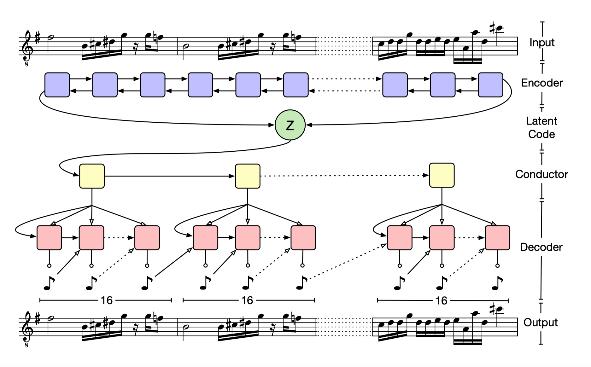

The music, which can be accessed [here](../src/music.mp3), was generated using a Recurrent Neural Network (RNN) trained on Bach's piano fugues. RNN is a class of Long Short-term Memory network and is especially adept to use information provided based on a timed sequence. The training set was sourced from [Bach Midi Index](http://www.bachcentral.com/midiindexcomplete.html), and the Neural Network Model was built using Google's [TensorFlow](https://www.tensorflow.org/) AI Library.

Here is a diagram I found outlining the basic process of music generation through RNN.

[^1]

[^1]: From Roberts, A., Engel, J., Raffel, C., Hawthorne, C. & Eck, D.. (2018). A Hierarchical Latent Vector Model for Learning Long-Term Structure in Music. Proceedings of the 35th International Conference on Machine Learning, in PMLR 80:4364-4373