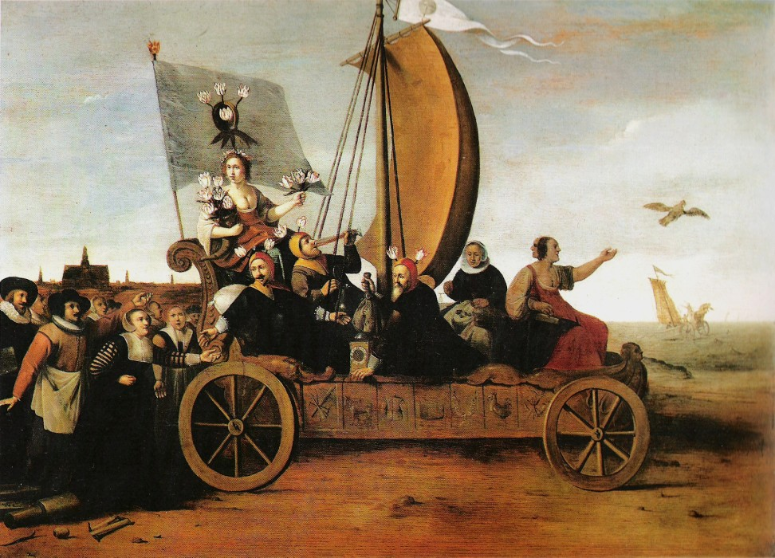

# Curation :: Preamble

My great-grandfather, a general and a World War II hero, was imprisoned, disenfranchised, and killed simply because he was of the wrong political party; my grandfather never had the chance to go to college because his social origin was “impure” and not proletarian; my grandmother, a middle-schooler, was almost killed in a massacre between the workers and the “subversives” during the Cultural Revolution; my parents were part of the protests that ended in the Tiananmen Square Massacre. It would be no wonder that I wish to learn the stories of the victims, victims of civil unrest, of genocides, of war, and of power.

---

> The easiest way... is to… build your own innocence on your status as victim.
>
> 
David Brooks, <em>The Retreat to Tribalism</em>

These victims often suffered immensely. People often assume plentiful innocence and virtue in the victims as a result of their sufferings. As with many overgeneralizations about diverse groups, this assumption only hides the truth about victims. The complexity of the real world often deviates from the ideal extremes, and many became victims because of their own wrongful actions or desires.

A notable example of this was the Dutch Tulip Mania. In his *Flora's Malle-wagen* (circa 1640), Hendrik Pot demonstrated the speculative nature of the tulip trade and suggested that the reason for the investors' sufferings were because of their own greed and immorality. His painting shows the flower goddess Flora riding a carnival cart with her followers. He commentated on the mania through his careful choice of subjects. Among her followers were three men wearing fool's caps and two mistresses. Pot sought to use these different followers to redicule and characterize the mania. These characters are Lie-all, who tells lies signifying deceit, Tospot, who drinks incessantly representing gluteny, Wealthcliffe and Mistress Take-it-in, weighing gold and symbolizing greed, and Mistress Vain Hope, whoes Bird of Hope had just escaped her. Right behind them on the road followed weavers from Haarlem with their equipment for production trampled under their feet. Through these subjects Pot sought to show that the mania was detrimental to society's moral and economic wellbeing.

Pot placed the subjects associated with flowers and indecent desires in the middle of the frame, obstucting the landscape, fracturing it into two uneven parts. On the left is the St. Bavo's Cathedral in Haarlem while on the right the sea is wailing. Howling wind inflates the sail to its fullest, heading towards the sea as did the cart in the distance. The careful placement of the landscape and the landscape suggests a departure from the morals and from God in pursuit of false idols and satisfaction of sins. God punishes these sinners who strayed from virtue by aiding them to their eventual demise in the sea with strong wind. 

Pot criticized the blind speculation of the Tulip Mania through his painting, and aslo presented an unfamiliar image of victims: one of self-victimization and suffering as a consequence of one's own actions.

{.illustration}

Image 1. *Flora's Malle-Wagen, painting by Hendrik Pot, circa 1640*

---

Some victims, however, does fit into the assumption of innocence and virtue. Some fought for the lives of others, while some were victimized because they stood up for their own ideals and believes.

---

Others still went through immense suffering or commited 

atrocity outweigh their wrongdoing or complex situation

In his book _Anna Karenina_, Leo Tolstoy wrote these immortal lines: "Happy families are all alike; every unhappy family is unhappy in its own way." A similar spirit should be applied to victims as well: bystanders are all alike, every victim is created in his or her own way. In my search for stories of victims, I was truly astonished by humanity's ingenuity for persecution and willingness for sacrifice as well as the resulted vast diversity of victims. As victims, nevertheless, they could not depend on history's fair depiction of their stories. They are, at any rate, victims and not the famed authors of history. Their stories are rarely preserved intact, often forgotten or distorted. Victors often recorded history with biases of their times, or depicted stories with a goal in mind as part of an argument. Even with more objective means of depiction, i.e. photography and film, the photographer still express authorial intent in the composition and the timing of the shots. Consequently, we, as the audience, should always beware of the biases the depictors might have used to interpret and present history.

---

These inaccuracies and biases often shroud the true stories of victims with a layer of mystery. The stories of some of the victims seem a lot more 